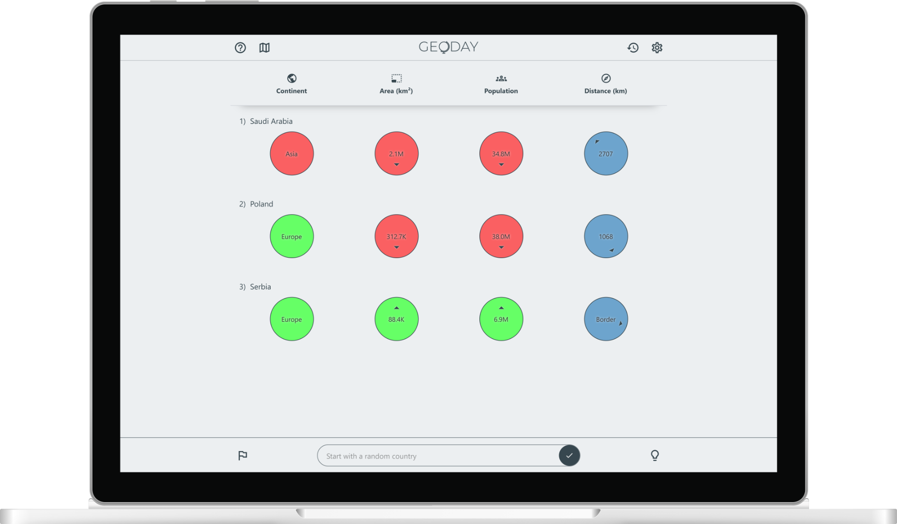
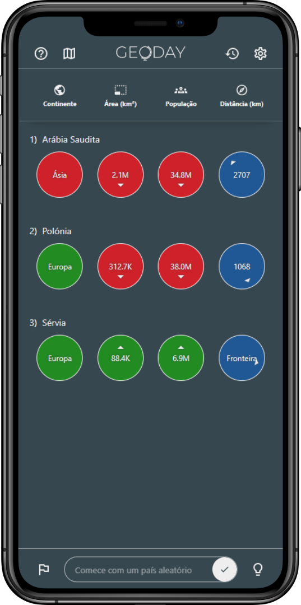

<h1>
    <p align=center>
        
    </p>
    <p align=center>
        GeoDay
    </p>
</h1>

<p align=center>
    <a href='https://geoday.vercel.app/'>geoday.vercel.app</a>
    <br/><br/>
    
    &nbsp;
    
    &nbsp;
    
</p>

&nbsp;

<p align=center>
    
    &nbsp;&nbsp;&nbsp;&nbsp;
    
</p>

&nbsp;

## 💡 Motivation

Your mission is to guess the country of the day using the data provided by your attempts!

Obviously, most people don't know the names of every countries in the world, so the game provides a map and hints to make things easier.

As a geography lover, this project is a great opportunity to create a daily game.

&nbsp;

## ✨ Features

- [x] 🔍 Search any country by name
- [x] 🔡 Multi-language support
- [x] 📱 Responsive layout
- [x] 🌙 Light/Dark mode
- [x] 🗺 World map

&nbsp;

- [ ] 📊 Better statistics
- [ ] 🎨 Win animation

&nbsp;

## ⚙️ Resources

### 🌐 API

The data about countries is retrieved using [REST Countries](https://restcountries.com/) API, an amazing open source and free to use project.

> [View repository](https://gitlab.com/restcountries/restcountries)

### 🗺 Map

This project uses [Leaflet](https://leafletjs.com/) map JS library to render the world map with simplicity, performance and usability.

> [View repository](https://github.com/Leaflet/Leaflet)  

&nbsp;

## 🖥️ Running the project

Clone the repository:

```bash
git clone https://github.com/gabriel-dp/geoday.git
```

Install the dependencies:

```bash
npm install
```

Run the app locally:

```bash
npm run dev
```
